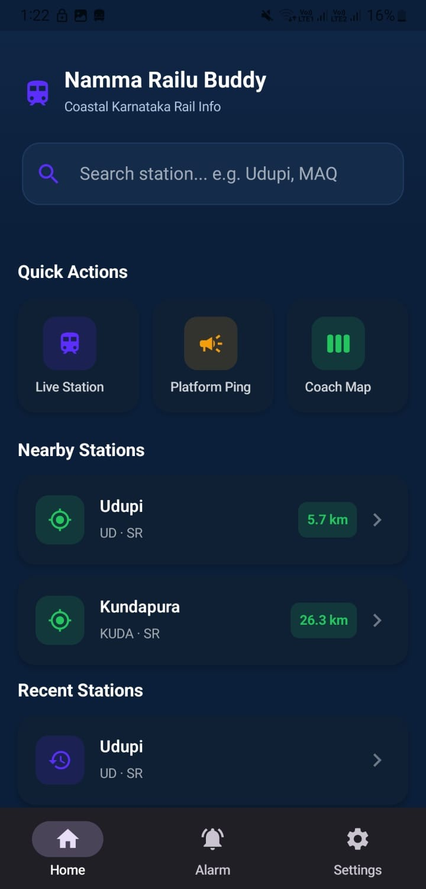

# Namma Railu Buddy

A comprehensive Android application designed to provide real-time railway information, platform updates, and coach position tracking for Indian Railways.

## Overview

Namma Railu Buddy is a mobile platform that enables users to access live train information, monitor platform updates, track coach positions, and receive real-time notifications about train movements and platform changes.

## Features

- Real-time train information and schedules
- Live platform updates and changes
- Coach position tracking for trains
- Station information and details
- User authentication and personalized dashboard
- Search and filter capabilities for trains and stations

## Screenshots

[Add screenshots showing: login screen, train search interface, platform updates, and coach position tracker]

## Screenshots

<p align="center">
        
        
        
        
        
        
</p>

## Tech Stack

- Language: Kotlin
- Build System: Gradle
- Database: Firebase Realtime Database
- Authentication: Firebase Authentication
- IDE: Android Studio
- Minimum SDK: Android 5.0 (API 21)

## Project Structure

```
NammaRailuBuddy/
├── app/                    # Main application module
│   ├── src/
│   │   ├── main/          # Application source code
│   │   └── test/          # Unit tests
│   └── build/             # Build artifacts
├── gradle/                # Gradle configuration
├── build.gradle.kts       # Root build configuration
├── settings.gradle.kts    # Project settings
├── local.properties       # Local SDK configuration
└── firebase_seed.json     # Firebase seed data
```

## Prerequisites

- Android Studio (Latest version)
- Java Development Kit (JDK 11 or higher)
- Gradle 7.0 or higher
- Firebase account with Realtime Database setup
- Google Play Services

## Installation and Setup

### 1. Clone the Repository

```bash
git clone https://github.com/sheethalkaran/namma-railu-buddy.git
cd namma-railu-buddy
```

### 2. Configure Local Properties

Update `local.properties` with your local SDK path:

```properties
sdk.dir=/path/to/android/sdk
```

### 3. Firebase Configuration

- Generate `google-services.json` from Firebase Console (Project Settings → Download google-services.json)
- Place `google-services.json` in the `app/` directory
- Initialize Firebase Realtime Database in your Firebase project
- Security rules are pre-configured in `firebase_rules.json`

### 4. Build the Project

```bash
./gradlew build
```

### 5. Run the Application

```bash
# Launch Android emulator first, then:
./gradlew installDebug

# Or run on connected device:
./gradlew installDebug -Pandroid.install.force=true
```

## How to Use

1. **Search Trains** - Enter station name or train number to find trains
2. **View Live Updates** - Check platform changes and real-time train status
3. **Track Coach Position** - Select a train to see coach-wise seating/positioning
4. **View Station Details** - Browse available stations and their information

## Database

Firebase Realtime Database collections:
- `stations` - Station information (indexed by code, name)
- `trains` - Train details (indexed by number)
- `platformUpdates` - Live updates (indexed by station_id, train_id)
- `coachPosition` - Coach positions (indexed by train_id)
- `users` - User profile data (isolated per user)


## Future Improvements

- Ticket booking integration
- Push notifications for train delays
- Seat availability tracking
- Multi-language support
- Offline mode with cached data

## License

MIT License - See LICENSE file for details

---

Developed as an internship project at MindMatrix
